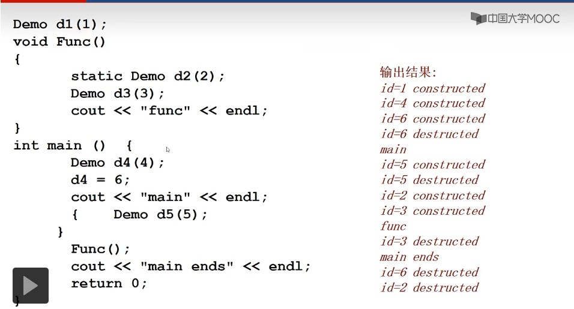

# 类和对象基础
## 类成员的可访问范围
1. private(默认):只能在成员函数访问
2. public:可以在任何地方访问
3. protected:~
- 类成员函数内部可以访问:
  - 当前对象、**同类其他对象**的全部属性、函数
- 类成员函数以外的地方，只能访问该类对象的共有成员

## 成员函数的重载及参数的缺省
- 使用缺省参数时，要避免函数的二义性

## 1. 构造函数
- 名字与类名一样,没有返回(void 也不行)
- 没有写任何构造函数时，编译器默认生成无参构造函数;写了构造函数，编译器不会再生成无参构造函数

## 2. 复制构造函数
- 只有1个同类对象的引用，形式必须是T &或const T&,有些编译器必须加上const
- 编译器默认会生成复制构造函数;写了自定义的复制构造函数,编译器不会再生成复制构造函数
```c++
class Comple{
  public:
    double real,imag;
    Complex(){};
    Complex(const Complex& c){//形式必须是T &或const T&
      real=c.real;imag=c.imag;
    }
}
```
- 复制构造函数起作用的三种情况(**在初始化(定义)状态下调用**)
  1. 当一个对象去初始化同类的另一个对象时
     - ```c++
        Complex c1=Complex();
        Complex c2=c1;//初始化语句,非赋值语句
        ```
  2. 函数形参中有对象时，相当于```Complex c2=c1;//初始化语句,非赋值语句```
  3. 函数返回值为对象时
- 对象间赋值不会调用复制构造函数
  ```c++
  Complex c1,c2;//调用无参构造函数
  c1.real=5;
  c2=c1;//不调用复制构造函数
  ```
- **常量引用参数的使用**
  ```c++
  void fun(CMyclass obj_){
    cout<<"fun"<<endl;
  }
  ```
  1. 函数调用时会引发复制构造函数的调用，开销大
  2. 可以用引用类型作为参数```CMyclass &```
  3. 可以添加```const```确保实参不被改变

## 3. 类型转换构造函数
- 实现类型的自动转换
- 只有一个参数且不是复制构造函数的构造函数
- 在需要时，编译器自动调用转换构造函数，建立一个临时变量

## 4. 析构函数
- ~T();
- 添加释放内存代码(delete),默认构造的无操作
```c++
class CMyclass{
  public:
    ~CMyclass(){cout<<"消亡"<<endl;}
}
CMyclass obj;
CMyclass fun(CMyclass sobj){//形参进行复制构造
  return sobj;//函数调用返回生成临时对象,形参消亡
}
int main(){
  obj=fun(obj);//函数调用被用过后，该临时对象消亡
  return 0;//程序执行完后,obj消亡
}//总共3次消亡!!!
```
- 
- python都是传引用!

