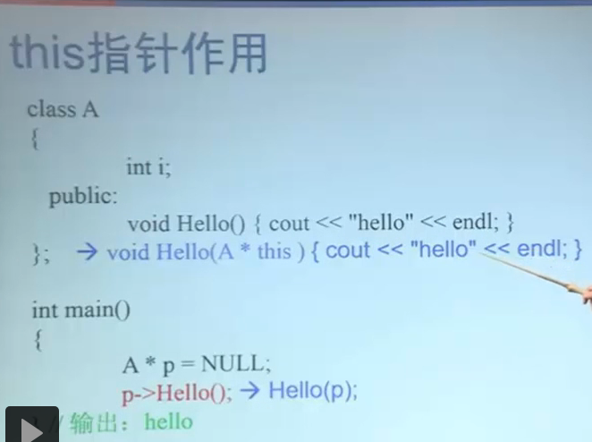
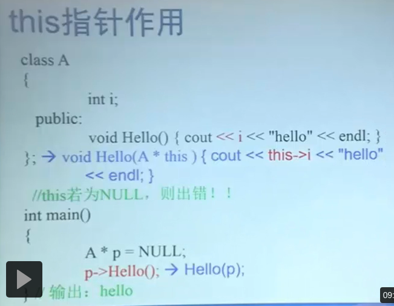

# 类和对象提高
## this指针
- 非静态成员函数中可以用this来代表该函数作用的对象指针
- 
- 

## 静态成员(static)
- 类中只有一个该变量,所有对象共享该变量
- sizeof不会计算静态成员变量
- 静态成员函数不具体作用于某个对象
- 静态成员不需要对象就能进行访问
    1. 类名::成员名
    2. 对象名::成员名
    3. 指针->成员名
    4. 引用.成员名
- 在静态成员函数中，不能访问非静态成员变量、非静态成员函数!!
- 注意下例,类默认建立
  - 构造函数
  - 复制构造函数
  - 类型转换构造函数:只有一个参数且不是复制构造函数的构造函数
  - 析构函数
- 当进行static变量修改时，各个部分都得修改
```c++
class CRectangle{
private:
    int w, h;
    static int nTotalArea;//统计所有矩形对象的总面积
    static int nTotalNumber;//统计所有矩形对象的总个数
public:
    CRectangle(int w_,int h_);
    ~CRectangle();
    static void PrintTotal();
};

CRectangle :: CRectangle(CRectangle & r ){//!!!在使用CRectangle类时,有时会调用复制构造函数生成临时的隐藏的CRectangle对象.临时对象在消亡时会调用析构函数,减少nTotalNumber 和nTotalArea的值。
    w = r.w;
    h = r.h;
    nTotalNumber ++;
    nTotalArea += w * h;
}
CRectangle::CRectangle(int w_,int h_){
    w = w_;
    h = h_;
    nTotalNumber ++;
    nTotalArea += w * h;
}
CRectangle::~CRectangle(){
    nTotalNumber --;
    nTotalArea -= w * h;
}
void CRectangle::PrintTotal(){
    cout << nTotalNumber << "," <<
    nTotalArea << endl;
}

int CRectangle::nTotalNumber = 0;
int CRectangle::nTotalArea = 0;
// 必须在定义类的文件中对静态成员变量进行一次说明
//或初始化。否则编译能通过,链接不能通过。
int main(){
    CRectangle r1(3,3), r2(2,2);
    //cout << CRectangle::nTotalNumber; // Wrong , 私有
    CRectangle::PrintTotal();
    r1.PrintTotal();
    return 0;
}
```

## 成员对象和封闭类
- 有成员对象的类 叫 封闭类
- 通过封闭类的构造函数的初始化列表```T(a,b,c):x(a),y(b,c)``` 进行成员对象的初始化
  - 先初始化对象成员,然后执行封闭类的构造函数
  - 调用顺序与对象成员在类中的**说明次序**一致,与初始化列表顺序无关
  - 消亡与构造函数次数相反

## 常量对象、常量成员函数
- const对象,不希望某个对象被修改
- const成员函数
  - **不能修改成员变量的值**，static除外
  - **不能调用同类的非常量函数**，static除外

## 友元(friend)
- **给被修饰的变量添加权限.**
- 友元函数:**一个类的友元函数可以访问该类的私有成员**(和static不一样)
```c++
class CCar ; //提前声明 CCar类,以便后面的CDriver类使用
class CDriver{
public:
    void ModifyCar( CCar * pCar) ; //改装汽车
};
class CCar{
private:
    int price;
    friend int MostExpensiveCar( CCar cars[], int total); //声明友元
    friend void CDriver::ModifyCar(CCar * pCar);//声明友元
};
void CDriver::ModifyCar( CCar * pCar){
    pCar->price += 1000; //汽车改装后价值增加
}
int MostExpensiveCar( CCar cars[],int total)//求最贵汽车的价格
{
    int tmpMax = -1;
    for( int i = 0;i < total; ++i )
        if( cars[i].price > tmpMax)
            tmpMax = cars[i].price;
    return tmpMax;
}
int main(){
    return 0;
}
```
- 友元类:如果A是B的友元类,那么A的成员函数可以访问B的私有成员
```c++
class CCar
{
private:
    int price;
    friend class CDriver; //声明CDriver是CCar的友元类
};
class CDriver
{
public:
    CCar myCar;
    void ModifyCar() {//改装汽车
        myCar.price += 1000;//因CDriver是CCar的友元类,
        //故此处可以访问其私有成员
    }
};
int main(){return 0; }
```
- **友元类之间的关系不能传递，不能继承**