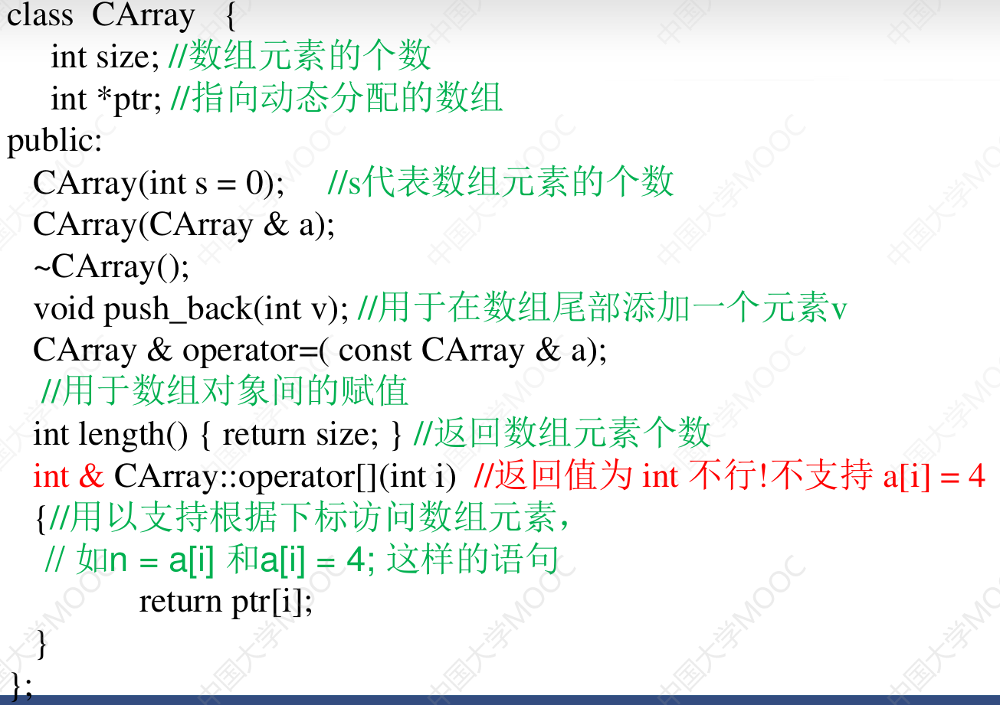
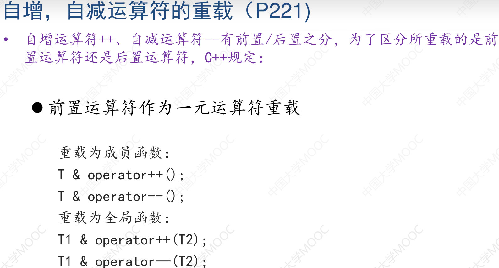

# 运算符重载
- 扩展C++中提供的运算符的适用范围，使之能作用于对象。
```
返回值类型 operator 运算符(形参表){
    ......
}
```

- 运算符一般可以重载为成员函数或者全局函数
- **赋值运算符=，只能重载为成员函数**
- **默认的=，如果不在初始化语句中，相当于将指针指向新地址.返回=左侧的引用**
```c++
class String{
    private:
        char * str;
    public:
        String():str(new char[1]){str[0]=0;}
        const char* c_str(){return str;}
        String & operator=(const char * s);
        ~String(){delete [] str;}
}
String & String::operator=(const char *s){//重载"="以使得obj="hello"能够成立,一个是String一个是const char *
    delete []str;
    str=new char[strlen(s) +1];
    strcpy(str,s);
    return *this;
}
int main(){
    String s;
    s="Good Luck";//等价于s.operator=("Good Luck")
    cout<<s.c_str()<<endl;
    String s2="hello";//初始化语句，由于没有对应的构造函数，报错
    return 0;
}
```

## 浅拷贝、深拷贝
- 默认赋值=为"逐成员变量赋值,不是改变地址"
- 下面的例子其实是改变的成员变量char *str,他本身为地址


## 运算符重载为友元
```c++
Complex c(1,2);
c=c+3;
c=3+c;//报错,如果没有友元函数
```


## 可变长数组类的实现



## 流插入运算符和流提取运算符的重载
## 重载类型转换运算符
```c++
operator double(){return real;}

(double) c;
```
## 自增自减运算符的重载


- 前置返回的是T&
- 后置返回的是T

- 一般后置的开销更大
