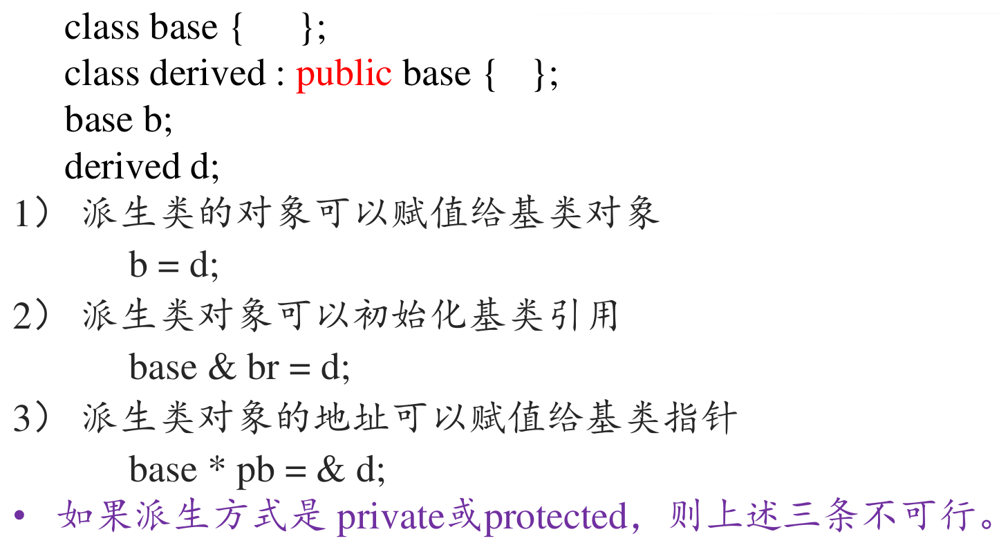

# 继承和派生
## 派生类
```类名:public 基类名```
- **派生类的各个成员函数中,不能访问基类中的private成员**

## 复合关系
- 主人拥有最多10条狗
- 每条狗有一个主人
- 设计类
```c++
class CMaster;//提前声明
class CDog{
    CMaster * pm;//主人的对象指针
}
class CMaster{
    CDog * dogs[10];//狗的对象指针
}
```
- 单个指针占用字节数为4(和操作系统有关,x86:4字节,x64:8字节)

## 覆盖


## protected


## 派生类的构造函数
- 通过初始化列表进行基类的初始化
- 

## public继承的赋值兼容规则


```c++
Base * ptrBase = &objDerived;
```
- 即便基类指针指向的是一个派生类的对象,也不能通过基类指针访问基类没有
,而派生类中有的成员。
- 通过强制指针类型转换,可以把ptrBase转换成Derived类的指针
```c++
Base * ptrBase = &objDerived;
Derived *ptrDerived = (Derived * ) ptrBase;
```
程序员要保证ptrBase指向的是一个Derived类的对象,否则很容易会出错。

## 直接基类与间接基类


