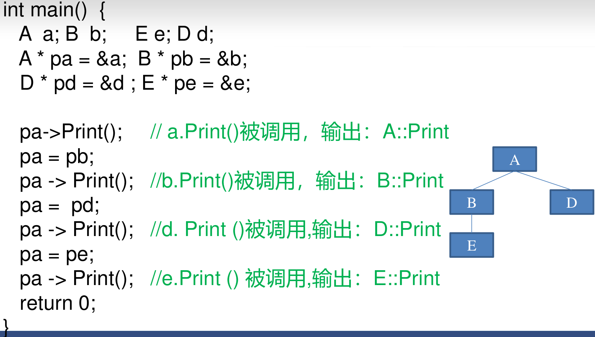
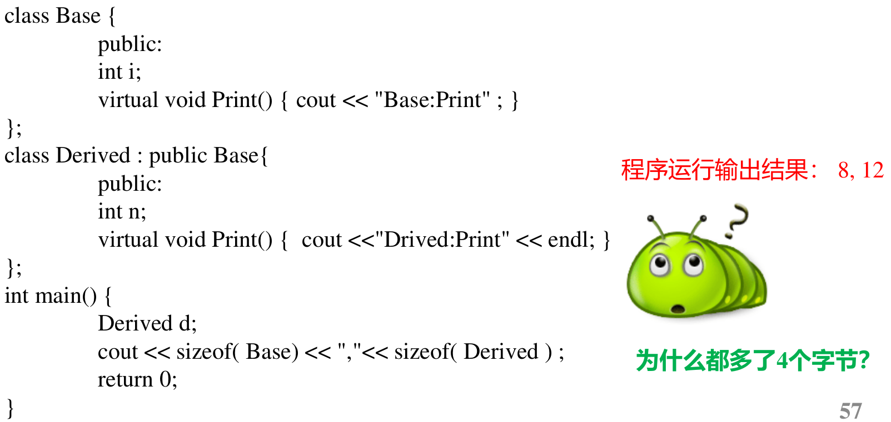
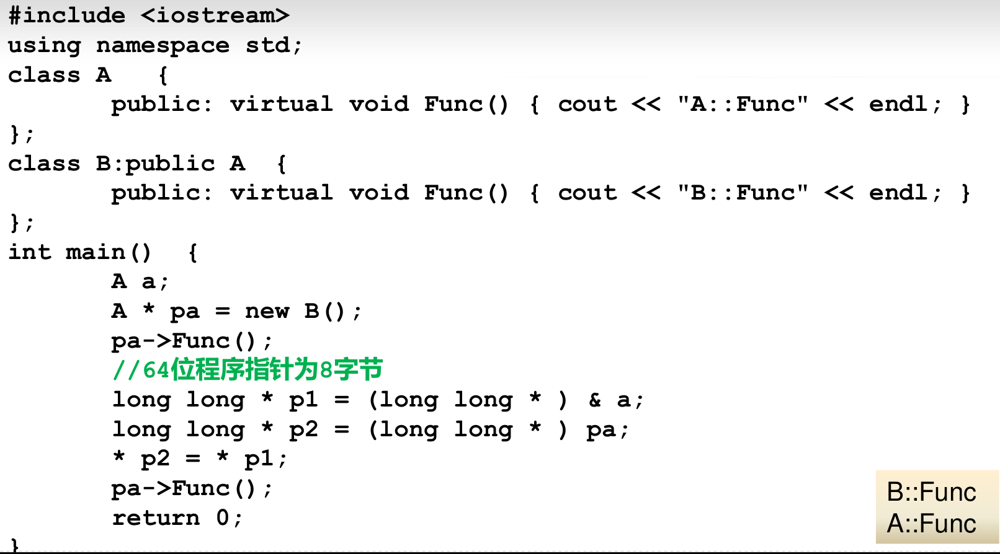

# 多态
## 虚函数
- 在类的定义中,前面有virtual关键字的成员函数为虚函数
```c++
class base{
    virtual int get();//virtual关键字只用在类定义的函数声明中
};
int base::get(){}//写函数体时不用加virtual
```
- 构造函数和静态成员函数不能是虚函数
- 虚函数可以参与多态，而其他普通函数不能参与多态

## 多态的表现形式
```c++
class CBase{
    public:
    virtual void x(){}
};
class CDerived:public CBase{
    public:
    virtual void x(){}
};
```
1. 派生类指针赋值给基类指针。调用哪个虚函数取决于p指向哪种类型的对象
```c++
    CDerived ODerived;
    CBase base;
    CBase *p=&base;
    p->x();//调用哪个虚函数取决于p指向哪种类型的对象,不是虚函数的话基类的该函数被覆盖
    CBase *p=&ODerived;
    p->x();
```
2. 派生类的对象可以赋给基类引用。调用哪个虚函数取决于引用哪种类型的对象
```c++
    CBase &r=ODerived;
    p->x();
    CBase &r=base;
    p->x();
```


## 多态实例
- 魔法门:每个怪物都有攻击、反击、受伤
### 非多态实现
```c++
class class CCreature {
protected:
    int nPower ; //代表攻击力
    int nLifeValue ; //代表生命值
};
class CDragon:public CCreature {
public:
    void Attack(CWolf * pWolf) {
        //...表现攻击动作的代码
        pWolf->Hurted( nPower);
        pWolf->FightBack( this);
    }
    void Attack( CGhost * pGhost) {
        //...表现攻击动作的代码
        pGhost->Hurted( nPower);
        pGohst->FightBack( this);
    }
    void Hurted ( int nPower) {
        //....表现受伤动作的代码
        nLifeValue -= nPower;
    }
    void FightBack( CWolf * pWolf) {
        //....表现反击动作的代码
        pWolf ->Hurted( nPower / 2);
    }
    void FightBack( CGhost * pGhost) {
        //....表现反击动作的代码
        pGhost->Hurted( nPower / 2 );
    }
}
```
- 有n种怪物,CDragon 类中就会有n个 Attack 成员函数,以及 n个FightBack
成员函数。对于其他类也如此。
- 如果游戏版本升级,增加了新的怪物雷鸟 CThunderBird,则程序改动较大。
- 所有的类都需要增加两个成员函数:
```c++
void Attack( CThunderBird * pThunderBird) ;
void FightBack( CThunderBird * pThunderBird) ;
```
### 多态实现
```c++
class CCreature {
protected :
    int m_nLifeValue, m_nPower;
public:
    virtual void Attack( CCreature * pCreature) {}
    virtual void Hurted( int nPower) { }
    virtual void FightBack( CCreature * pCreature) { }
};
class CDragon : public CCreature {
public:
    virtual void Attack( CCreature * pCreature);
    virtual void Hurted( int nPower);
    virtual void FightBack( CCreature * pCreature);
};
void CDragon::Attack(CCreature * p){
    //...表现攻击动作的代码
    p->Hurted(m_nPower); //多态
    p->FightBack(this); //多态
}
void CDragon::Hurted( int nPower){
    //...表现受伤动作的代码
    m_nLifeValue -= nPower;
}
void CDragon::FightBack(CCreature * p){
    //...表现反击动作的代码
    p->Hurted(m_nPower/2); //多态
}
```
- 如果游戏版本升级,增加了新的怪物雷鸟 CThunderBird......
- 只需要编写新类CThunderBird,
- 不需要在已有的类里专门为新怪物增加:
```c++
void Attack( CThunderBird * pThunderBird) ;
void FightBack( CThunderBird * pThunderBird) ;
```


- 用基类指针数组存放指向各种派生类对象的指针，然后遍历该数组，就能对各个派生类对象做各种操作。
- qsort自定义的函数参数需要是const void \*类型,**传入的\*s1是 (指针数组的元素) 指向对象的地址 ,因此\* \*s1才是对象!!!**

- 
- **在非构造函数,非析构函数的成员函数中调用虚函数,是多态!!!**
- **在构造函数和析构函数中调用虚函数,不是多态**。编译时即可确定,调用的函数是自己的类或基类中定义的函数,不会等到运行时才决定调用自己的还是派生类的函数。
- 派生类中和基类虚函数同名同参数的函数，不加virtual也自动成为虚函数
  


## 多态的实现原理
- 
- 
- 

```c++
#include <iostream>
using namespace std;
class Base{
private:
    int a;
public:
    void print(){cout<<"基类"<<endl;};
    virtual void x(){cout<<"x:基类"<<endl;};
};
class Derived:public Base{
private:
    int b;
public:
    void print(){cout<<"继承"<<endl;};
    virtual void x(){cout<<"x:继承"<<endl;};
};
int main(){
    Derived d=Derived();
    Base base=d;//拷贝构造函数??然后只拷贝成员变量,不改变其他成员函数
    base.print();//基类
    base.x();//基类

    Base base_=Base();
    base_=d;//不调用复制构造函数,调用赋值函数=,逐成员变量赋值,不改变其他成员函数
    base_.print();//基类
    base_.x();//基类

    Base *p=&d;
    p->print();//基类
    p->x();//继承,多态
}
```
|   Base   |    Derived    |
| :------: | :-----------: |
| 虚函数表 |   虚函数表    |
|    a     |   Base::a()   |
| print()  | Base::print() |
|    -     |       b       |
|    -     |    print()    |

```c++
Base *p=&d;//可以访问共同的部分:虚函数表、Base::a、Base::print().通过虚函数表进行多态
Base base=d;//拷贝构造函数??然后只拷贝成员变量,不改变其他成员函数
base_=d;//不调用复制构造函数,调用赋值函数=,逐成员变量赋值,不改变其他成员函数
```

- **虚函数表的存在**
    - 
    - 将原来多态的pa指针指向虚函数表地址替换为基类的首地址(虚函数表地址),再调用虚函数则是基类的虚函数

## 虚析构函数


## 纯虚函数和抽象类


