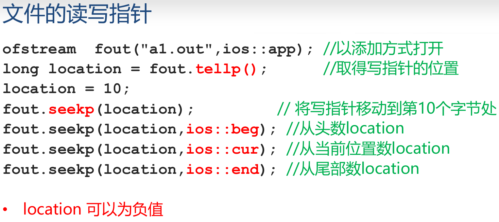
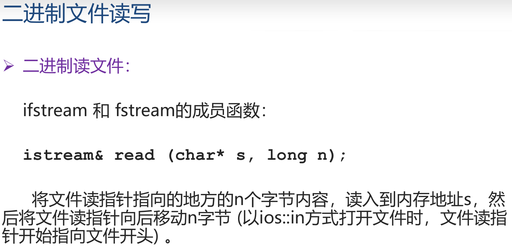

# 输入输出流及模板
## 标准流对象


```c++
int x;
while(cin>>x){//强制类型转换了
    ...
}
```


## 文件读写




- 数据在内存比在硬盘读写快，记得close

## 二进制读写



# 模板
## 函数模板


- **匹配模板函数时,不进行类型自动转换**

```c++
#include <iostream>
using namespace std;
template<class T,class Pred>
void Map(T s, T e, T x, Pred op)
{
    for(; s != e; ++s,++x) {
        *x = op(*s);
    }
}
int Cube(int x) {return x * x * x; }
double Square(double x) { return x * x; }

int a[5] = {1,2,3,4,5}, b[5];
double d[5] = { 1.1,2.1,3.1,4.1,5.1} , c[5];

int main() {
    Map(a,a+5,b,Square);
    for(int i = 0;i < 5; ++i) 
        cout << b[i] << ",";
    cout << endl;//1,4,9,16,25,

    Map(a,a+5,b,Cube);
    for(int i = 0;i < 5; ++i) 
        cout << b[i] << ",";//1,8,27,64,125,
    cout << endl;

    Map(d,d+5,c,Square);
    for(int i = 0;i < 5; ++i)
        cout << c[i] << ",";//1.21,4.41,9.61,16.81,26.01,
    cout << endl;
    return 0;
}
```

## 类模板
```c++
template <class 类型参数1,class 类型参数2,......> //类型参数表
class 类模板名
{
    成员函数和成员变量
};
```
```c++
template <typename 类型参数1,typename 类型参数2,......>
//类型参数表
class 类模板名
{
    成员函数和成员变量
};
```
用类模板定义对象的写法:
- 类模板名 <真实类型参数表> 对象名(构造函数实参表);
- 类模板的“<类型参数表>”中可以出现非类型参数
```c++
template <class T, int size>
class CArray{
    T array[size];
public:
    void Print( ){
        for( int i = 0;i < size; ++i)
            cout << array[i] << endl;
        }
}
```

```c++
template <class T1,class T2>
class Pair
{
public:
    T1 key;//关键字
    T2 value;//值
    Pair(T1 k,T2 v):key(k),value(v) { };
    bool operator < ( const Pair<T1,T2> & p) const;
};
template<class T1,class T2>
bool Pair<T1,T2>::operator < ( const Pair<T1,T2> & p) const
//Pair的成员函数 operator <
{
    return key < p.key;
}

int main()
{
    Pair<string,int> student("Tom",19);
    //实例化出一个类 Pair<string,int>
    cout << student.key << " " << student.value;//Tom 19
    return 0;
}
```
- **同一个类模板的两个模板类是不兼容的**
```C++
Pair<string,int> * p;
Pair<string,double> a;
p = & a; //wrong
```


## 类模板与派生、友元和静态成员变量

