# STL
## string类
- 头文件\<string\>
```c++
string s1("Hello");
string month = "March";
string s2(8,'x');//8个'x'  ‘8*8

string error1='c';//错误初始化,字符不能直接初始化给string
string error2('u');//错误初始化,字符不能直接初始化给string
string error3=22;//错误
string error4(0);//错误

string s;
s='n';//可以将字符赋值给string
```

- 支持的操作
```c++
string s;
s.length();
cin>>s;//空格、\t、换行停下
getline(cin,s);//读取一整行
string s2;s2=s;//赋值
s2.assign(s);//复制
s2.assign(s,1,3);//部分复制  从下标1开始长度3
s2[5]=s1[3]='a';//单个字符复制
s.at(3);//会做范围检查
s+=s2;//连接字符串
s.append(s2);
s.append(s2,3,s1.size());//下标从3开始s1的长度,如果字符串没有足够字符,则复制到字符串最后一个字符
s==s1;s>s2;//比较运算符,返回bool
s.compare(s1);//比较,s==s1 0,s>s1 1.s<s1 -1
s.compare(1,2,s1,0,3);//比较s下标1开始2字符与 s1小表0开始3字符
s.substr(4,5);//从下标4长度5的子串
s.swap(s1);//交换
s.find("as");//查找，返回从前往后的第一个下标
s.rfind("as");//从后往前查找
s.find("as",3);//从下标3开始查找
s.find_first_of("asd");//查找参数中任一字符第一次出现的下标
s.erase(5);//删除下标5之后的字符串
s.replace(2,3,"haha");//s从下标2开始3个字符替换为haha
s.insert(5,s1);//s下标5处插入s1
s.c_str();//转换为传统的const char*类型字符串,且该字符串以'\0'结尾
s.data();//转换为char *;尽量不用
```
- python中不能对string进行string[1]赋值操作,但C++中可以

## STL
- 标准模板库(STL):常用数据结构和算法的模板集合
  - 容器:类模板
  - 迭代器:类似指针
  - 算法:函数模板

## 容器
- 当一个对象放入容器时，被插入的是对象的一个**复制品**
- 有些容器本身就是排序的，所以放入容器的对象所属的类往往一概重载==和\<运算符
- 顺序容器和关联容器都有的函数
  - 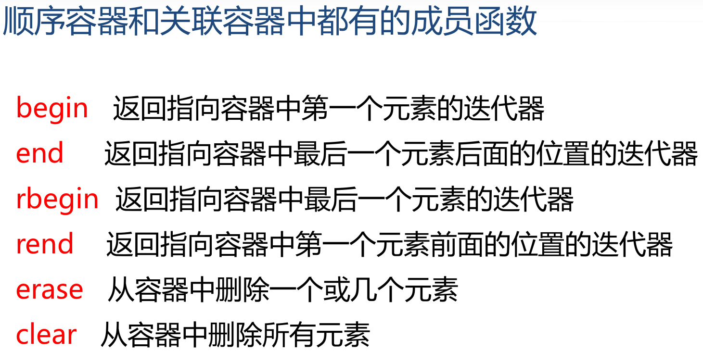

### 顺序容器
- 顺序容器中常用的函数
  - 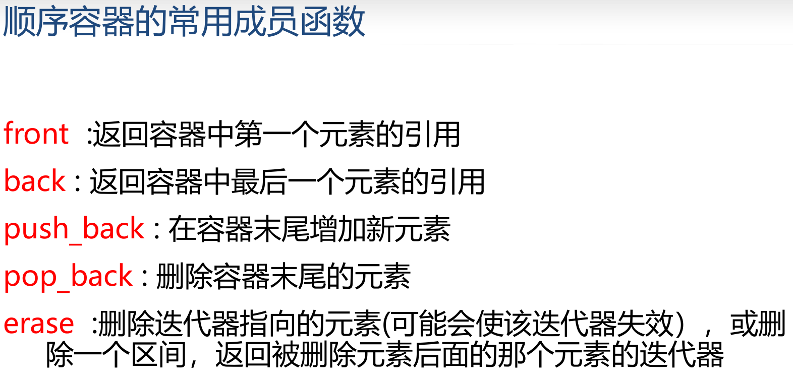
##### vector(向量、动态数组)
- #include \<vector>
- 在尾部增删时,大部分情况是常数时间,但如果超过长度需要分配空间+复制原数组

##### dequeue(双向队列)
- #include \<dequeue>
- head、tail两个指针
- 数组形式，非链表
- 在两端增删元素大部分是常数时间,但如果超过长度需要分配空间+复制原数组
- 存取时间次于vector,当tail超过空间长度时tail从头部开始存，需要计算tail的位置
- 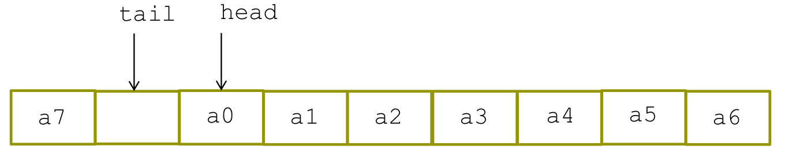

##### list(双向链表)
- 不支持随机存取,即没有下标
- 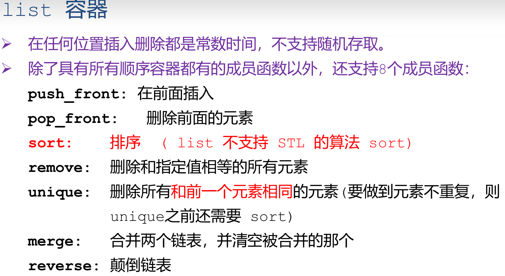
- 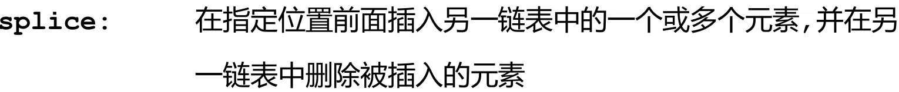
### 关联容器
- 元素都是排序的，内部元素是从小到大排序 
- 插入任何元素都应按照对应的排序规则来确定其位置
- 通常以平衡二叉树方式实现，插入和检索的时间都是O(log(N))
- 关联容器通用函数
  - 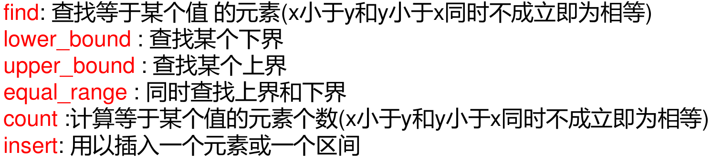
  - lower_bound:使X[:it]<val
  - upper_bound:使X[it:]>val

#### set/multiset
- #include \<set>
- set中不允许相同元素，multiset中允许
- 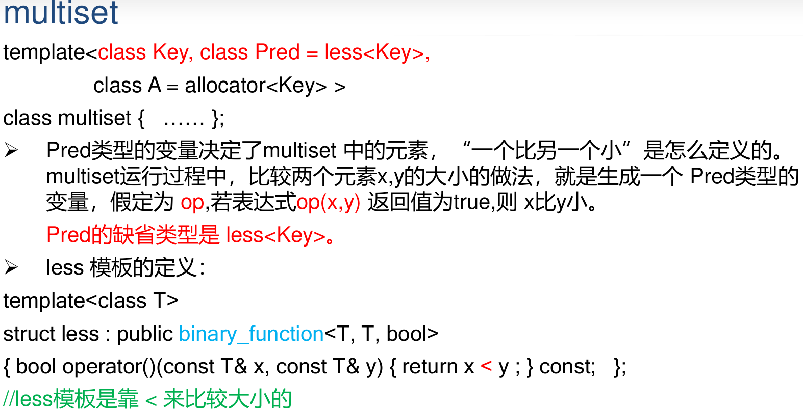
- 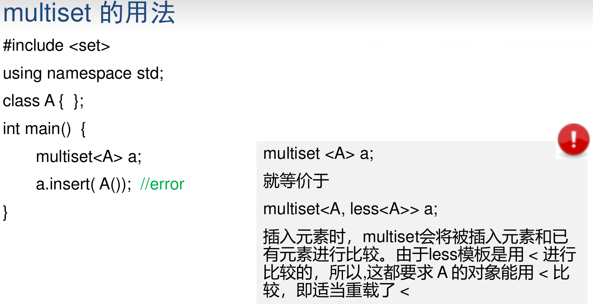

#### map/multimap
- #include \<map>
- map:不允许相同的key值
- multimap:允许相同key值
- 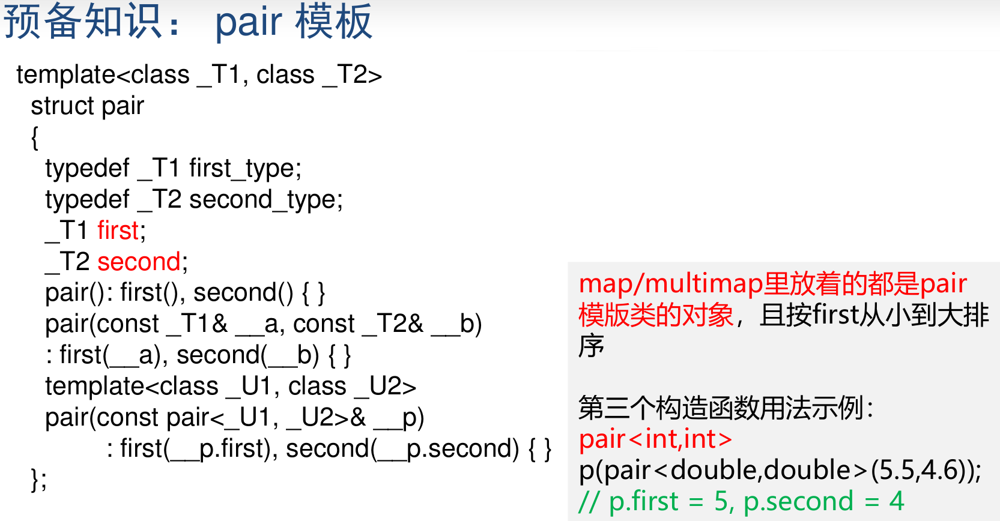
- 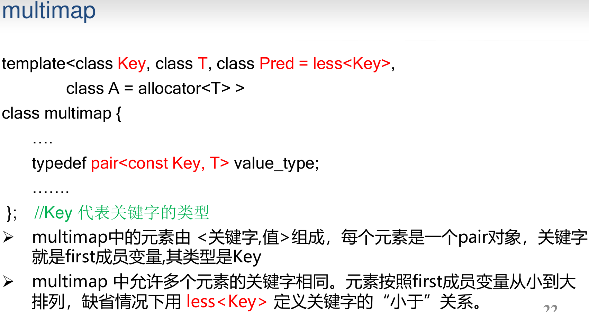
- map可以用[],而multimap没有重载[]

### 容器适配器
#### stack
- #include \<stack>
#### queue
- #include \<queue>
#### priority_queue
- #include \<queue>

## 迭代器
- 和指针很像
- 定义一个容器类的迭代器的方法可以是:```容器类名::iterator 变量名;```,或:```容器类名::const_iterator 变量名;```
- 访问一个迭代器指向的元素:```* 迭代器变量名```
```c++
#include <vector>
#include <iostream>
using namespace std;
int main()
{
    vector<int> v; //一个存放int元素的数组,一开始里面没有元素
    v.push_back(1);v.push_back(2);v.push_back(3);v.push_back(4);
    
    vector<int>::const_iterator i;//常量迭代器
    for( i = v.begin();i != v.end();++i )
        cout << * i << ",";//1,2,3,4
    cout << endl;

    vector<int>::reverse_iterator r;//反向迭代器
    for( r = v.rbegin();r != v.rend();r++ )
        cout << * r << ",";//4,3,2,1
    cout << endl;

    vector<int>::iterator j;//非常量迭代器
    for( j = v.begin();j != v.end();j ++ )
        * j =100;
    for( i = v.begin();i != v.end();i++ )
        cout << * i << ",";//100,100,100,100
}
```
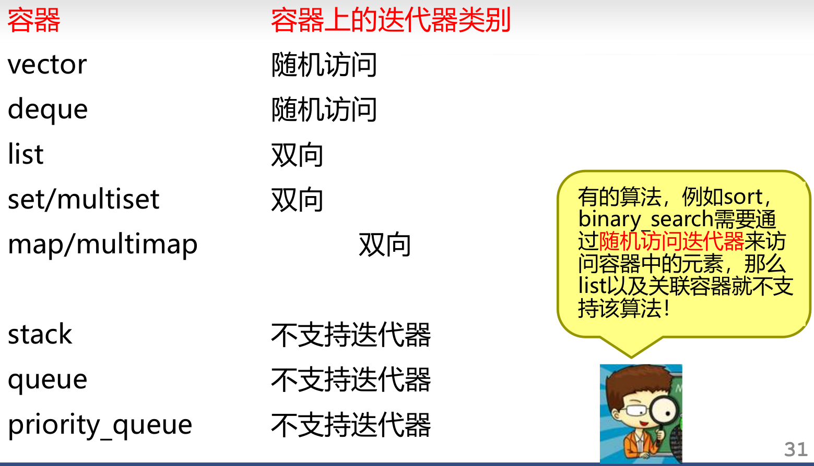

## 算法
- 算法就是一个个函数模板, 大多数在\<algorithm\> 中定义
- STL中提供能在各种容器中通用的算法,比如查找,排序等
- 算法通过迭代器来操纵容器中的元素。许多算法可以对容器中的一个局部区间进行操作,因此需要两个参数,一个是起始元素的迭代器,一个是终止元素的后面一个元素的迭代器。比如,排序和查找
- 有的算法返回一个迭代器。比如 find() 算法,在容器中查找一个元素,
并返回一个指向该元素的迭代器
- 算法可以处理容器,也可以处理普通数组
- 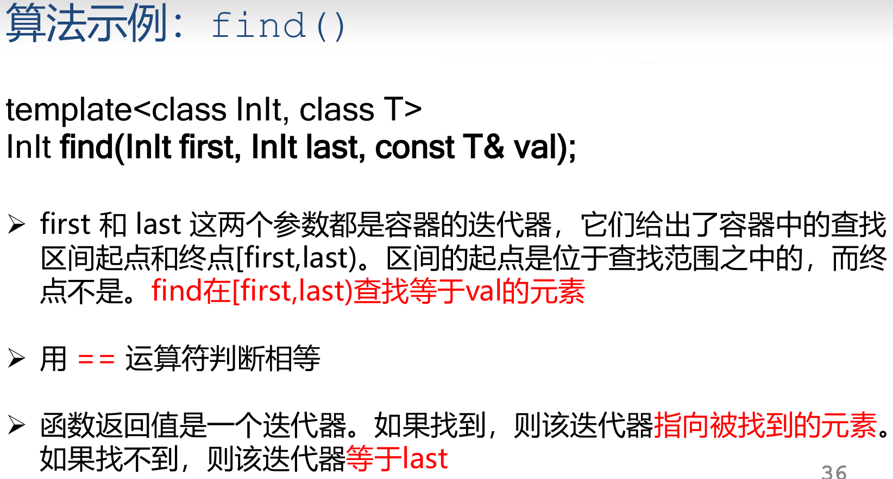

- 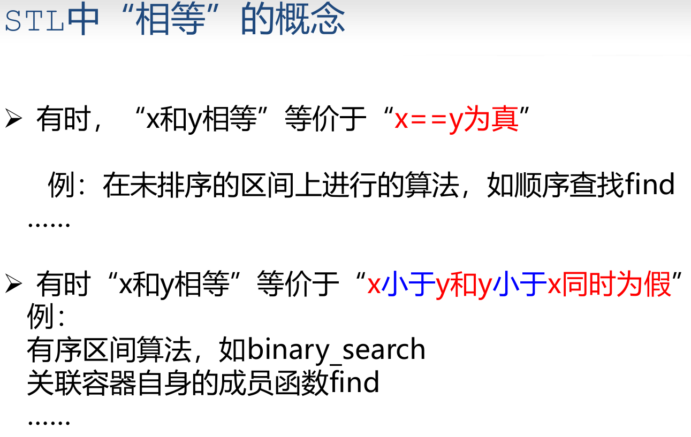
- 注意如果自定义类binary_search调用\<操作进行比较，如果重载的\<一直返回false，那么即使全部查找数中没有查找值也会说查找成功

- 函数对象
- 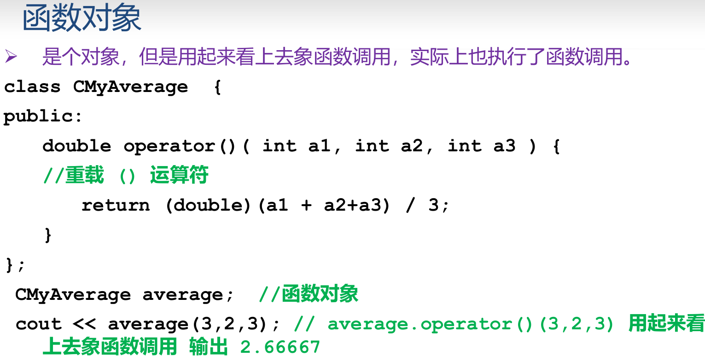
- 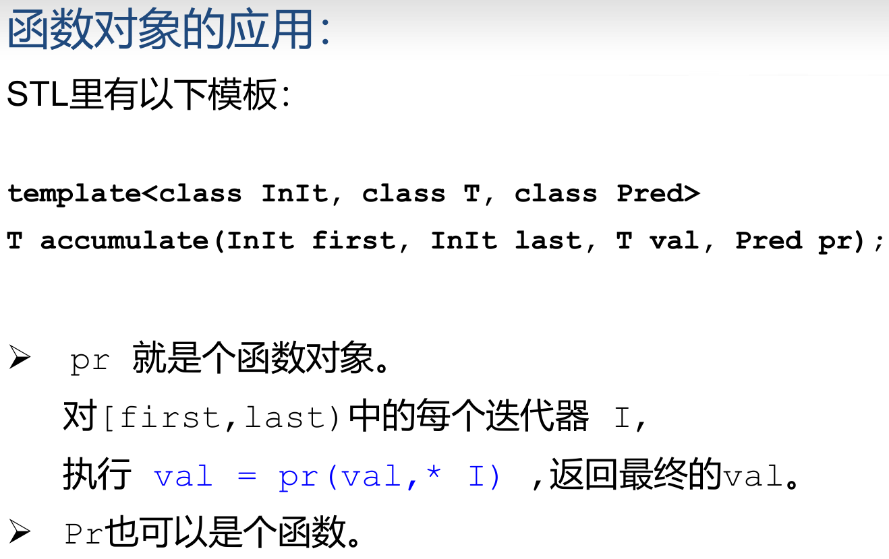

